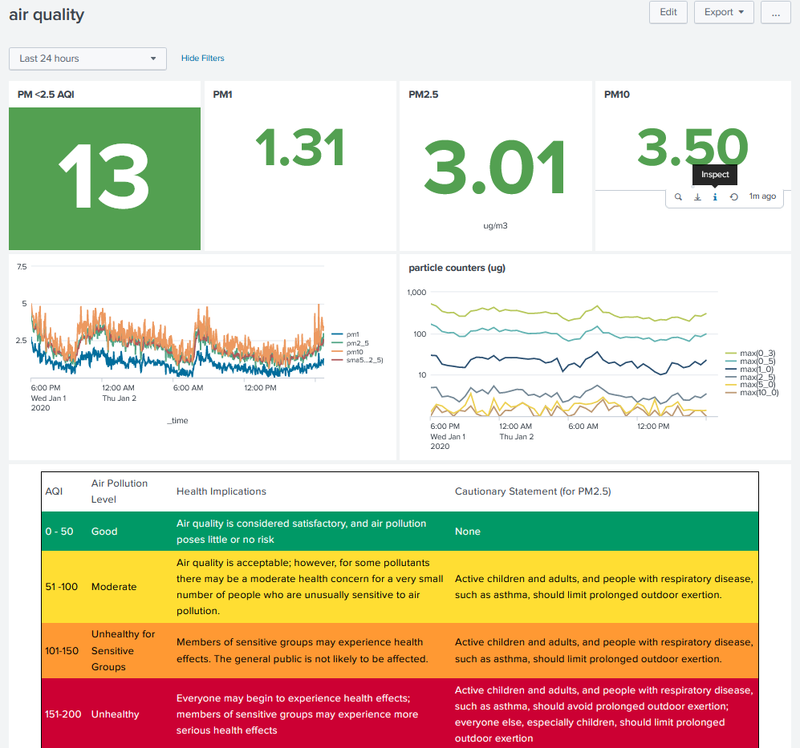

# pairi


## PurpleAir Intercepter

A custom web server which intercepts calls from the PurpleAir monitor. Use a custom DNS host(A) record to impersonate api.thingspeak.com.

Ingest the access logs with splunk, make a nice dashboard.




### Details

The device sends 3 different HTTP requests every 2 minutes. They look similar to the following:

```
127.0.0.1 - - [13/Aug/2019 06:26:29] "GET /update?key=<key1>&field1=3.04&field2=5.17&field3=5.81&field4=13002&field5=-52&field6=89&field7=31&field8=5.17 HTTP/1.1" 200 -
127.0.0.1 - - [13/Aug/2019 06:26:29] "GET /update?key=<key2>&field1=618.09&field2=200.88&field3=40.46&field4=2.68&field5=0.96&field6=0.53&field7=3.04&field8=5.81 HTTP/1.1" 200 -
127.0.0.1 - - [13/Aug/2019 06:26:29] "GET /update?key=<key3>&field4=25768&field5=0.02&field6=1016.38 HTTP/1.1" 200 -
```

* For `<key1>`, the AQI indicators
  - PM1 = field1
  - PM2.5 = field2
  - PM10 = field3

* `<key2>` reports particle counters, in ug per deciliter.

* `<key3>` reports temperature, humidity, and pressure.

* The source for the splunk dashboard is in dashboard.xml.


